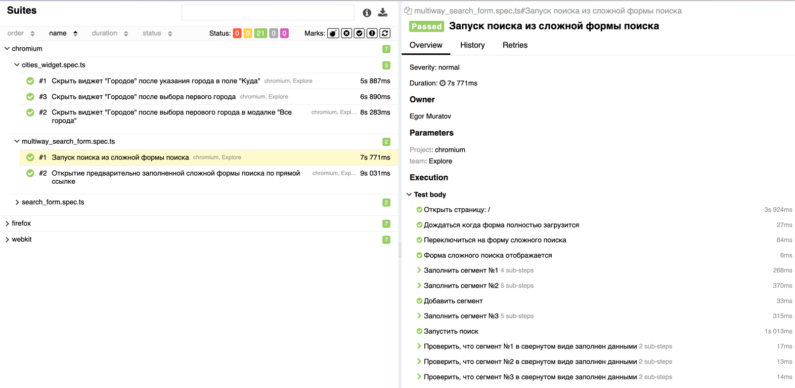
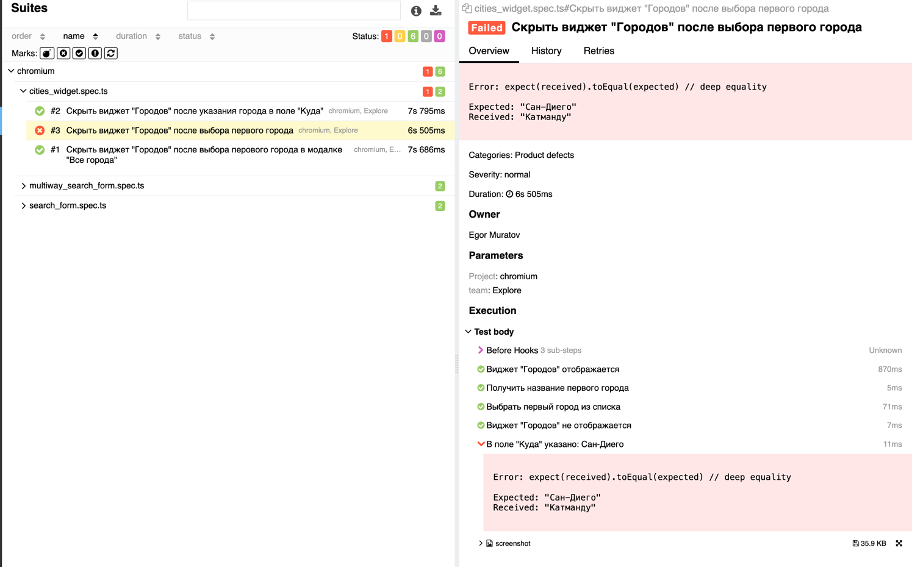

# Allure

Allure - это фреймворк для создания красивых отчетов о результатах тестирования. Он позволяет создавать отчеты, которые
легко читать и понимать, даже если человек, который их читает, не участвовал в написании тестов.

В проекте стоит разделять [Allure Report](https://allurereport.org/) и [Allure TestOps](https://qameta.io/). Первый
предназначен для отображения результатов тестов, а второй для управления тестами и их результатами.

При написание тестов важно добавлять "обёртки" для каждого действия, чтобы в отчете было видно, что именно происходило в
тесте. Для этого используем `allure.step`.

```ts
    await allure.step(`Выбор даты вылета`, async () => { 
      await this.chooseDate(startDate);
    });
```

Чтобы тесты правильно синхронизировались с Allure TestOps, необходимо добавлять в тесты мета-информацию. Для этого
используем `allure.testInfo`. Обязательный параметр - это ID теста. Остальные параметры - это дополнительная информация
о тесте.

```ts
    await allure.testInfo({id: "8418", owner: "Egor Muratov", team: "Explore"});
```

## Просмотр отчета на локальной машине

Для того чтобы отобразить отчет локально, нужно выполнить команду `yarn report`. Отчет откроется автоматически в окне
браузера, а так же будет доступен по адресу `./allure-report/index.html`.


_Отчет об успешно пройденных тестах_

В отчёте можно увидеть все тесты, которые были запущены, их результаты, а также дополнительную информацию о тестах. В
случае если тест упадет, в отчете будет видно, на каком шаге тест упал, и какие данные были в тесте на момент падения.


_Отчет c упавшим тестом_

## Просмотр отчета в Allure TestOps

_В разработке_
